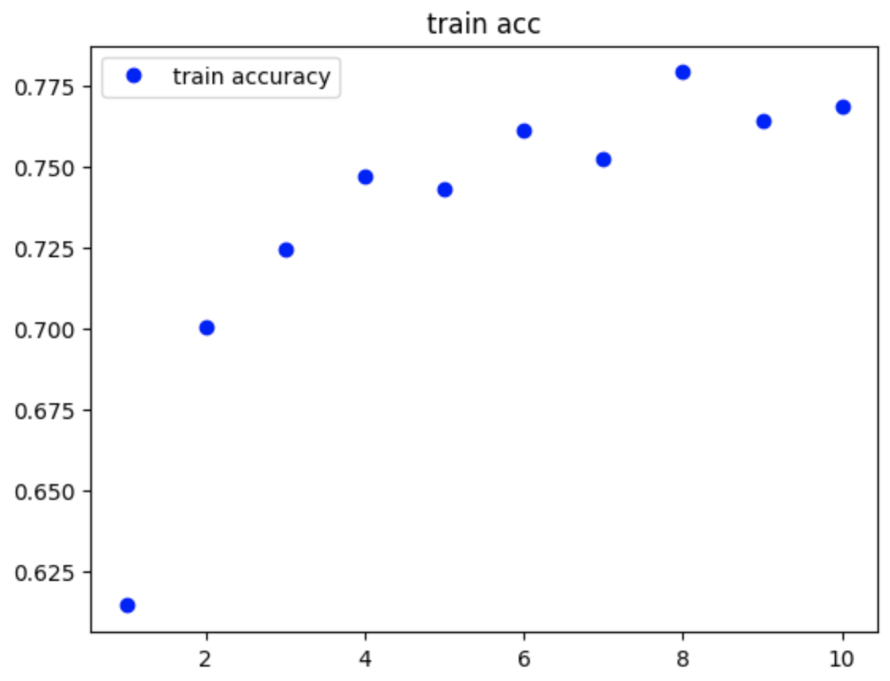
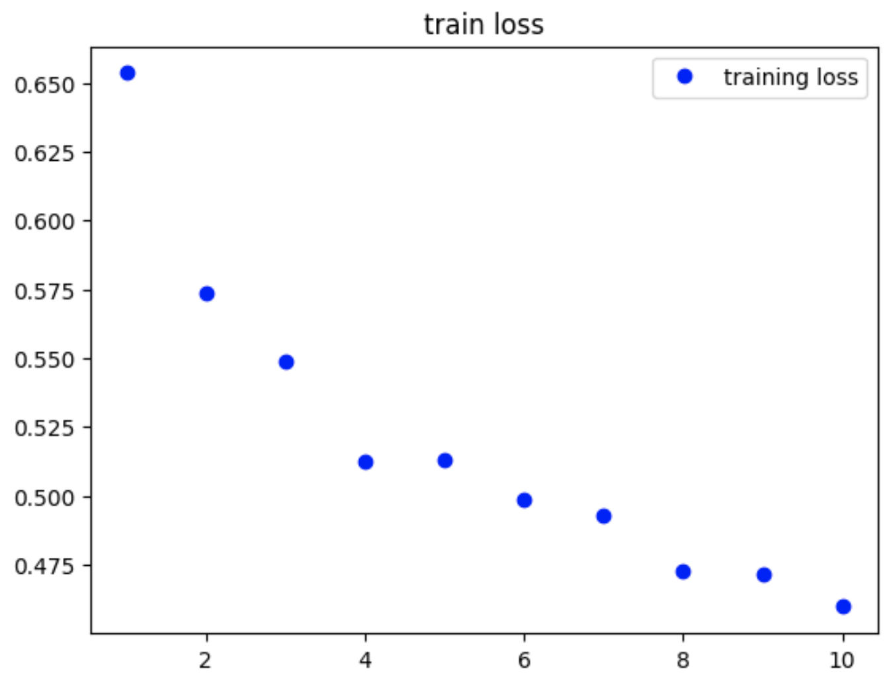
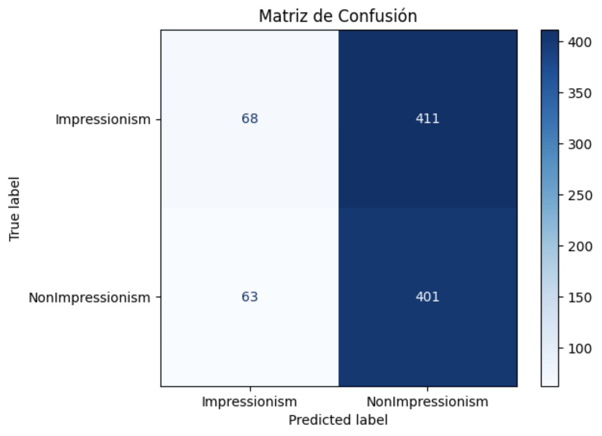
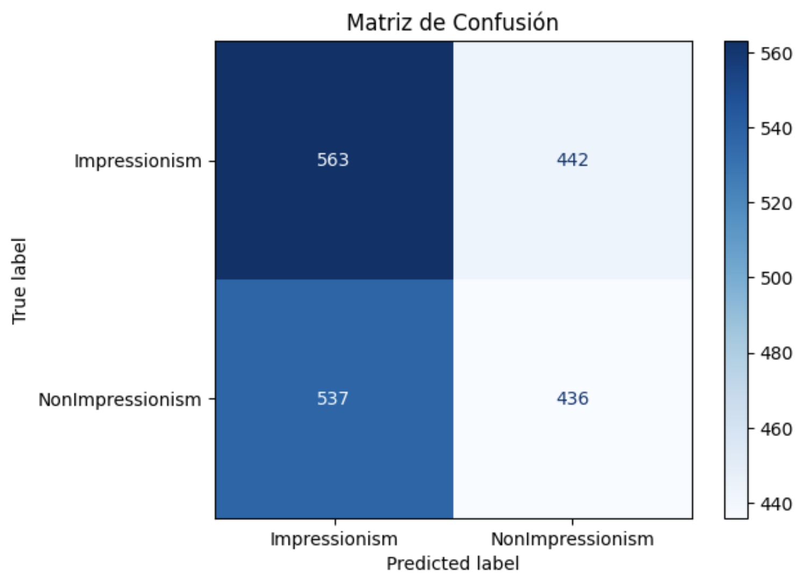
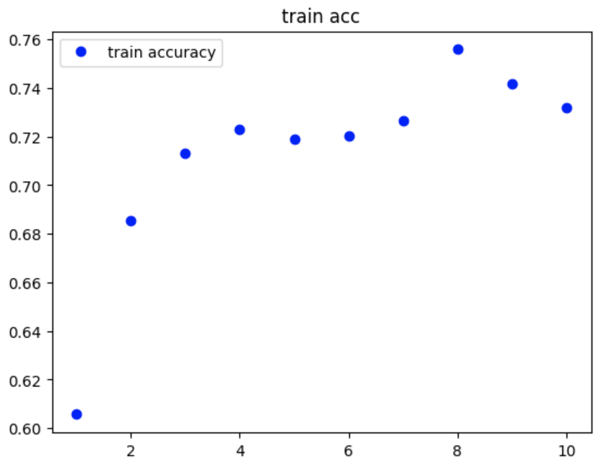
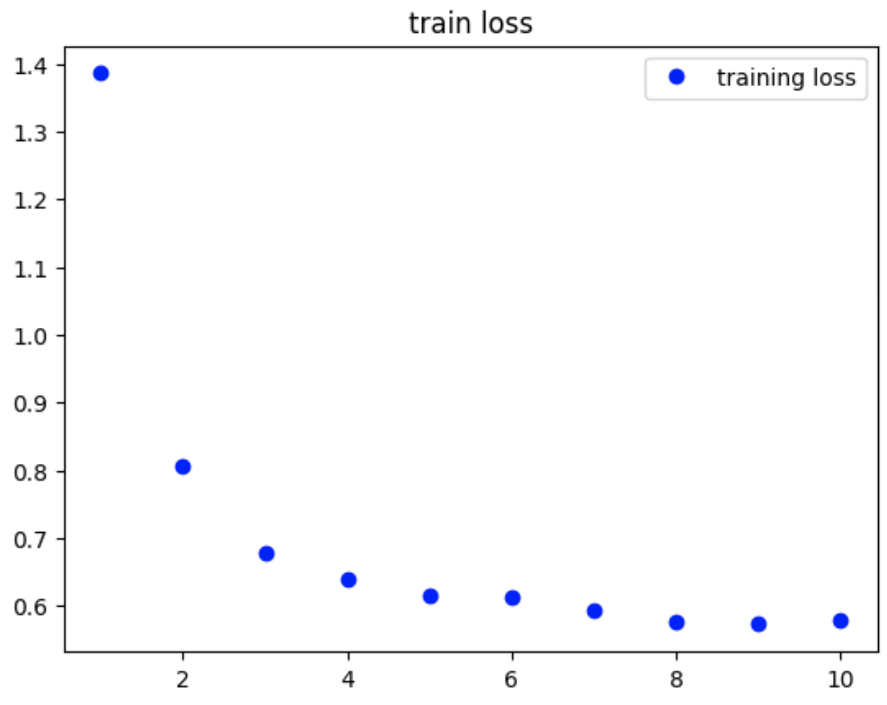
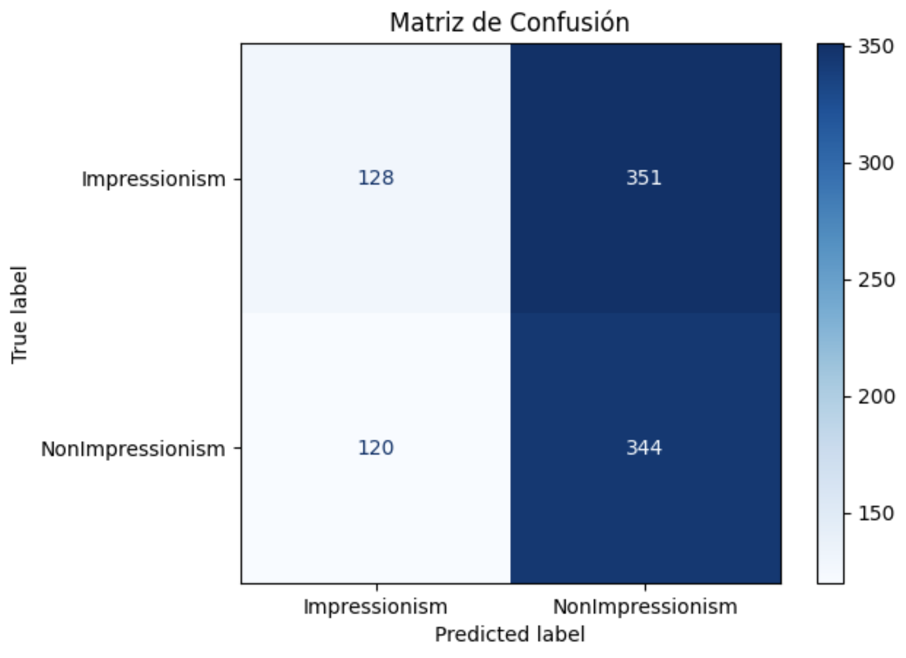
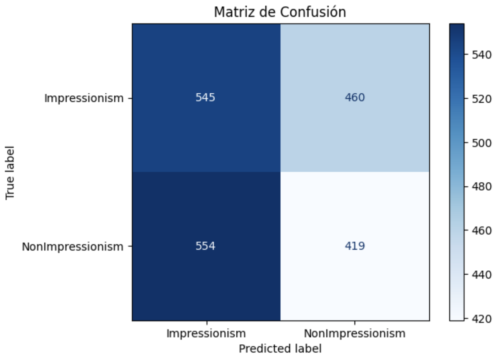

# Art Style Classifier

## TC3002B

### Arisbeth Aguirre Pontaza A01274803

## Documentación del Dataset

**Descripción:** Este dataset contiene imágenes de diversas pinturas que pertenecen a la corriente del impresionismo o a otras corrientes artísticas.

**Fuente del Dataset:** El dataset original fue obtenido de Kaggle, [Best Artworks of All Time](https://www.kaggle.com/datasets/ikarus777/best-artworks-of-all-time/data). Sin embargo, este fue modificado por mí el 13 de abril del 2024.

**Autores:** [Icaro](https://www.kaggle.com/ikarus777), [artchallenge.ru](https://artchallenge.ru/?lang=en)

**Información Relevante:** La estructura inicial del dataset fue modificada, dividiendo a todos los trabajos de los artistas impresionistas de los de otras corrientes, para así poder identificar dicho estilo artístico de forma más fácil.

**Tamaño del dataset:**

- **Pinturas impresionistas:** 1595 (50.8%)
- **Pinturas de otras corrientes artísticas (no-impresionistas):** 1545 (49.2%)

**Distribución del dataset:**
La distribución del dataset fue hecha de forma aleatoria usando el script anexo randomized_images.py

**Pinturas impresionistas:**

- **Train:** 1116 (70%)
  - **Validation:** 111 (10%)
- **Test:** 479 (30%)

**Pinturas no-impresionistas:**

- **Train:** 1081 (70%)
  - **Validation:** 108 (10%)
- **Test:** 464 (30%)

[Link del dataset actualizado (Google Drive)](https://drive.google.com/drive/folders/13U8wAopsLEXEF5I0QQ_WmhCwxb_A8Uqy?usp=sharing)

## Preprocesamiento de los datos

Se aplicó un redimensionamiento de 150x150 píxeles y se normalizaron las imágenes para que sus píxeles solamente tengan valores de 0 a 1.

También, a partir del set de train, se generaron nuevas imágenes. De forma más específica, un batch de 32 por cada época y con un rango de rotación de 20, un rango de brillo entre 0.8 - 1, y con posibilidad de cambiar su orientación vertical y horizontal.

## Validación de los datos

Se creó una carpeta de validación, en donde el 15% de los datos del set de train fueron almacenados. Para este set de imágenes también se aplicó un preprocesamiento a las imágenes para redimensionarlas y normalizarlas.

## Implementación del modelo

Para la implementación del modelo revise los siguientes papers:

[Artistic Style Recognition: Combining Deep and Shallow Neural Networks for Painting Classification](https://www.mdpi.com/2227-7390/11/22/4564)

[Attention-based VGG-16 model for COVID-19 chest X-ray image classification](https://link.springer.com/article/10.1007/s10489-020-02055-x)

Y con lo revisado implementé un modelo de transfer learning, tomando como modelo base una red neuronal VGG-16, pre-entrenada con ImageNet, sin incluir su última capa. A este modelo posteriormente le agregué una capa densa de 64 neuronas con activación ReLu, una capa de Dropout del 30% y por último una capa densa de 1 neurona con activación sigmoid para hacer la clasificación entre pinturas impresionistas y no impresionistas [1][2].

Este modelo, posteriormente fue entrenado a lo largo de 10 épocas, obteniendo como resultado las siguientes métricas:

- **loss:** 0.4777
- **accuracy:** 0.7557
- **validation loss:** 0.4912
- **validation accuracy:** 0.7626

## Testing del modelo

En esta parte, usando el dataset de test, se evalúo el modelo con 25 steps y se obtuvo el siguiente resultado:

- **test accuracy:** 0.5885

## Evaluación del modelo

Para evaluar el modelo, tome como referencia uno de los papers mencionados anteriormente, en el que se habla de las métricas de precision, recall y f1 score [1]. Investigando más fondo estás se pueden definir de la siguiente manera:

- **Precision:** Una métrica para observar cuantas de las predicciones positivas son correctas. Se centra en la calidad de las predicciones positivas del modelo.

- **Recall:** También llamada Sensitivity, es una métrica para observar cuantos de los casos positivos el modelo clasificó correctamente.

- **F1 score:** Es una métrica que evalúa la eficiencia general del modelo combinando la precision y el recall. En otras palabras es el promedio armónico de la precision y el recall para medir la capacidad del modelo para ser preciso y completo al mismoo tiempo.

Tomando esto en cuenta, realicé la evaluación del modelo, obteniendo los siguientes resultados:

- **Precision:** 0.4938
- **Recall:** 0.8642
- **F1 score:** 0.6285

Con lo que se puede observar que el modelo tiene un buen recall pero que, en contraste, no tiene muy buena precisión y observando la matriz de confusión de test:

Podemos ver que el modelo prácticamete clasificó a todas las pinturas como no imprresionistas.

Y observando la matriz de confusión en train:

Se puede observar que el modelo predice todas como impresionistas, esto junto con su accuracy, la cuál está muy alta, nos dice que el modelo se encuentra con overfitting, está memorizando las imágenes y posteriormente todas las clasifica de forma contraria.

## Refinamiento del modelo

Tras los resultados mostrados previamente y haberse notado el overfitting del modelo, se tomó en cuenta las siguiente consideración para el refinamiento del modelo:

- **Uso de regularizadores:** Para evitar que la red se ajuste tanto a la distribución del dataset.

Tras algunas corridas del modelo, al agregar regularizadores pude percatarme de que el test accuracy mejoraba, y, al agregar un valor de 0.012 de l2 regularizers, fue el momento en el que ví que el test accuracy de mi modelo mejoró considerablamente, de 58% a 66.1%, razón por la cuál decidí mejorar al modelo con este parámetro.

A continuación muestro las métricas correspondiente al modelo elegido:

En train

- **loss:** 0.5758
- **accuracy:** 0.7322
- **validation loss:** 0.5697
- **validation accuracy:** 0.7489

En test:

- **test accuracy:** 0.6617

Métricas:

- **Precision:** 0.4938
- **Recall:** 0.7413
- **F1 score:** 0.5936

Matriz de Confusión en Test:

Matriz de Confusión en Train:

Con ello podemos observar como la memorización del modelo bajó y así, mejoró el test accuracy del modelo.

## Conclusión

|                | Versión inicial | Versión refinada |
| -------------- | --------------- | ---------------- |
| Train accuracy | 0.7557          | 0.7322           |
| Train Loss     | 0.4777          | 0.5758           |
| Test accuracy  | 0.5885          | 0.6617           |
| Precision      | 0.4938          | 0.4938           |
| Recall         | 0.8642          | 0.7413           |
| f1-score       | 0.6285          | 0.5936           |

Cómo se puede observar en la tabla, aunque la primera versión tiene mejor accuracy y loss en training, sus resultados en test muestran que el modelo se encuentra con overfitting y se inclina mucho hacia el Impresionismo. Sin embargo, en la versión refinada del mismo podemos observar que, aunque también se encuentra con overfitting, debido a la inclusión de regularizadores, ya no memoriza de forma tan detallada el dataset, lo que hace que pueda tener un mejor deseempeño en training. Por esta razón, como la versión refinada ya no se encuentra con tanto sesgo hacia una clase, el modelo se desempeña mejor que la versión inicial (un 8% mejor para ser exactos).

## Referencias

[1]
S. Imran et al., “Artistic Style Recognition: Combining Deep and Shallow Neural Networks for Painting Classification,” Mathematics, vol. 11, no. 22, pp. 4564–4564, Nov. 2023, doi: https://doi.org/10.3390/math11224564
‌

[2]
C. Sitaula and M. B. Hossain, “Attention-based VGG-16 model for COVID-19 chest X-ray image classification,” Applied Intelligence, Nov. 2020, doi: https://doi.org/10.1007/s10489-020-02055-x.
